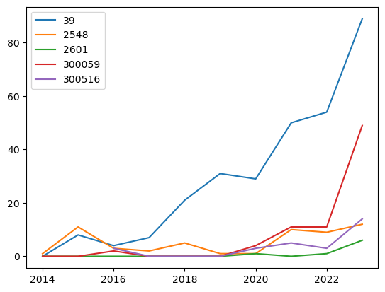

# 2024 最新cninfo巨潮资讯公告下载与词频分析（完结版）！
* 目的:得到上市公司关注点的面板数据(示例如下)；
<!-- 插入图片本地 -->

## 运行时间概述：
* 100个公司（十年跨度），下载花费1小时；分析花费0.5小时；需要空间50G；
* 6000个公司，大约下载花费3天；分析花费1.5天；需要空间3T;(当然可以尝试下载完直接分析，然后移除)
## 设计思路：
1. 公司code，获取公司页面；
2. 公司页面获取公告链接；
3. 公告链接获取pdf或html；
4. 对pdf或html进行词频统计；
## 更想说明：
* 20240307-并行下载；（本项目已完结，不再更新）
* 20240306-pdf直链使用推断模式，效率大幅提升；
* 20240305-支持中断恢复；
## 使用说明：
* 方案一：自行筛选公司代码，下载main.ipynb文件，于jupyter下运行；
* 方案二：下载 output/02_announcements_list.csv ，从报告下载处开始运行；
## 注意：
* 具体示例详见其余相关文件；
* 有任何问题欢迎提交issue；
* 或📮邮件与我联系: picker_warlock_0u@icloud.com
* 这是我痛苦毕设的一部分，希望能帮到你；
## 免责申明：
* 本项目仅供学习交流使用，不得用于商业用途，否则后果自负！ -->
